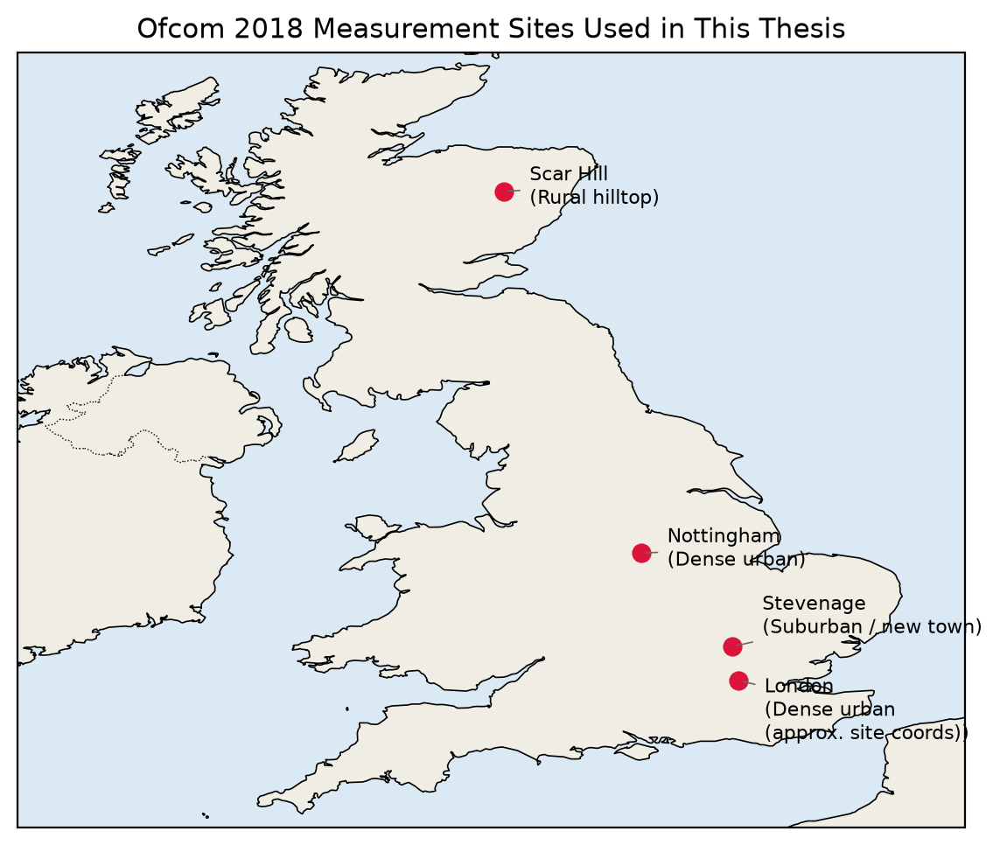
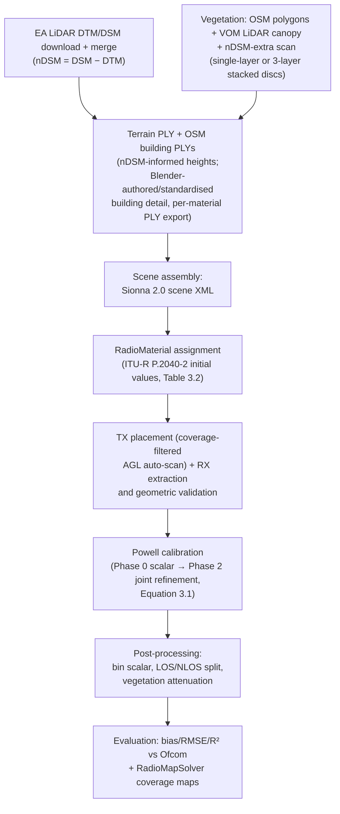

# Chapter 3 — Research Methodology

This chapter explains how the research problem and objectives set out in Chapter 1, and the gap identified in Chapter 2, were actually investigated: the overall research strategy, the tools and data used and why, the assumptions and constraints that bound the work, and the step-by-step procedure followed — in enough detail that another researcher could reproduce it. Every feature and processing step actually implemented in this project's notebooks is highlighted here, not only the headline result.

## 3.1 General Methodological Approach

This is **simulation-based, model-driven quantitative research**, combining deterministic electromagnetic ray tracing with empirical calibration against independent real-world measurements. It is neither purely analytical (the propagation environments are too geometrically complex for closed-form solution) nor purely empirical/statistical (Chapter 2 established that classical empirical models cannot answer this thesis's research questions about frequency-dependent, site-specific failure modes). Instead, a physics-based simulator (Sionna RT [3]) is used to generate predictions from an explicit 3D representation of each site, and those predictions are calibrated and validated against a large, independent, public measurement dataset (Ofcom 2018 [5]) — directly the combination Chapter 2 found under-represented in the literature at sub-6 GHz macrocell frequencies.

Two software generations were used across the project's timeline: an initial **Sionna 0.19** pipeline (TensorFlow backend, Mitsuba 2.1.0-format `scene.xml`), later migrated to **Sionna 2.0** (Mitsuba 3.5.2/Dr.Jit backend, `scene_sionna2.xml`) using a dedicated migration script, once the newer engine's GPU performance and differentiable-calibration support proved necessary for the sample counts this thesis required (Section 2.5.3).

The overall workflow, applied independently at each site/frequency combination (Nottingham at 915/1802/2695/3602 MHz, London at 915 MHz, Scar Hill at 915 MHz, Stevenage at 915 MHz), follows the pipeline detailed in full in Section 3.4 (Figure 3.1). Figure 3.3 shows the geographic distribution and environment type of these four sites.

*Figure 3.3 — The four Ofcom 2018 measurement sites used in this thesis, spanning dense urban (Nottingham, London), suburban/new-town (Stevenage), and rural hilltop (Scar Hill) environments. London's marker uses an approximate site coordinate, as the exact transmitter location is documented in the site-specific CSV header rather than reproduced here. Site plotted with Cartopy/Natural Earth coastline data.*

1. Construct a 3D scene from terrain, building, and vegetation data for the site.
2. Assign initial material electromagnetic properties from ITU-R reference values.
3. Place the transmitter and receivers, with automated height selection and geometric validity checks.
4. Calibrate material properties against a subset of the site's measurements using gradient-free optimisation.
5. Apply post-processing corrections (vegetation attenuation, distance-bin and LOS/NLOS adjustments) informed by the theory in Sections 2.1.7–2.1.8.
6. Evaluate the calibrated, corrected model against the full measurement set using the metrics defined in Section 2.1.9, across cumulative distance ranges, and generate spatial coverage maps.

This approach is appropriate to the research questions (Section 1.4) for three reasons. First, RQ1 and RQ3 ask how accuracy varies with frequency and what ceiling geometry-and-material calibration alone can reach — answering this requires an actual calibrated simulator producing quantitative R²/RMSE/bias figures, not a qualitative or purely theoretical argument. Second, RQ2 (vegetation modelling as wavelength decreases) requires comparing multiple concrete modelling choices (disc geometry vs. transparent canopy vs. post-hoc correction) under otherwise identical conditions — only possible with a working simulation pipeline that can be reconfigured and re-run. Third, RQ4 (urban vs. rural generalisation) requires applying the same methodology to sites with fundamentally different terrain data availability (metre-scale LiDAR vs. 30 m SRTM), which is a controlled comparison a simulation-based approach can isolate in a way a single-site experimental measurement campaign cannot.

Within this overall strategy, the work also proceeded **iteratively rather than in one pass**: for the Nottingham 915 MHz site, the scene was built up feature-by-feature (buildings and terrain only → adding vegetation → adding roads, water, bridges, and railways), with accuracy re-evaluated at each stage before proceeding (Table 3.1). This incremental approach is itself methodologically deliberate: it isolates which scene features improve or degrade accuracy, rather than only reporting a single end-to-end result whose sensitivity to individual modelling choices would otherwise be unknown.

**[TABLE 3.1]**

| Scene configuration | R² @ 0–750 m | R² @ 0–1000 m | R² @ 0–1250 m |
|---|---|---|---|
| Buildings + terrain only (baseline) | 0.716 | 0.679 | 0.496 |
| + grid-disc vegetation | 0.692 | 0.691 | 0.383 |
| + roads, water, vegetation (calibrated) | 0.696 | 0.609 | 0.401 |
| + bridges, railways (uncalibrated) | 0.555 | 0.530 | 0.487 |
| Full scene, recalibrated (100M eval samples, 0.15 km near-field floor) | **0.835** | **0.813** | **0.741** |

*Table 3.1 — Iterative scene-evolution methodology, Nottingham 915 MHz (ON incoherent method). Each row adds scene features to the previous configuration and re-evaluates against the Ofcom measurements before proceeding, isolating the effect of each addition rather than reporting only a final combined result.*

## 3.2 Tools, Models, Software, and Data Used

| Tool / Data | Role in this research | Why appropriate | Reference |
|---|---|---|---|
| **Sionna RT 2.0** (migrated from an earlier Sionna 0.19 pipeline via a dedicated migration script) | Core ray-tracing engine: resolves reflection, diffraction, and scattering paths between transmitter and receivers | GPU-accelerated, differentiable, open-source — supports the sample counts (up to 100M per evaluation) and repeated re-calibration this thesis requires, and its `RadioMaterial`/`PathSolver`/`RadioMapSolver` API directly implements the theory in Sections 2.1.2–2.1.6 | [3] |
| **Mitsuba 3** + **Dr.Jit** | Rendering/geometry backend and differentiable JIT compiler underlying Sionna RT | Required dependency of Sionna RT; `cuda_ad_rgb` variant enables GPU execution (Section 2.5.2) | [12], [13] |
| **UK Environment Agency LiDAR** (1 m DTM/DSM, merged and nDSM-derived) | Terrain elevation and vegetation-canopy-height data for scene construction (Nottingham, London; also expected for Stevenage — Hertfordshire is within EA coverage, but this has not been confirmed against a Stevenage-specific notebook) | Highest-resolution open terrain data available for England; nDSM (DSM − DTM) recovers above-ground clutter height not present in OSM tags | [8] |
| **SRTM 30 m DEM** | Terrain elevation data for Scar Hill (Scotland, north of the EA LiDAR coverage boundary at ~55.9°N) | Only terrain source available for this site at project time; its coarser resolution is treated as an explicit constraint (Section 3.3), not silently absorbed into the result | — |
| **OpenStreetMap** (via `osmnx`, `geopandas`) | Building footprints, road, water, and land-use polygons | Free, continuously updated, and already the standard geometry source paired with LiDAR in the literature (Section 2.1.3) | OpenStreetMap contributors |
| **Blender** | Authoring/refining building geometry beyond raw OSM footprints; standardising material names to Sionna's taxonomy and exporting per-material PLY meshes | Needed where OSM footprint/height data alone is insufficient for a given building; the dedicated Blender→Sionna 2.0 baking guide documents this as a repeatable, three-phase procedure (preserve original → standardise materials → export PLYs per material) | — |
| **Ofcom 2018 UK Radiowave Propagation Measurement dataset** | Ground-truth path-loss measurements for calibration and evaluation | Large (8.2M measurements), public, multi-frequency (six bands, 449 MHz–5850 MHz), multi-site — the only dataset identified in Chapter 2 combining these properties at sub-6 GHz | [5] |
| **ITU-R P.2040-2** | Initial (pre-calibration) material permittivity/conductivity values | Standard, citable reference values rather than arbitrary starting points for the Powell optimiser | [17] |
| **ITU-R P.833-10** / **Weissberger's model** | Vegetation attenuation post-processing | Weissberger used at 915/1802 MHz (its original validated range); ITU-R P.833-10 preferred at 2695/3602 MHz where Weissberger is known to under-estimate attenuation by ~40% (Section 2.1.7) | [16], [18] |
| **ITU-R P.1411-10** / **3GPP TR 38.901** | Dual-slope breakpoint distance formula (Equation 2.13) | Determines the LOS-regime distance bound used to scope calibration at each frequency (Section 3.3) | [15], [6] |
| **Powell's conjugate-direction method** (via `scipy.optimize`) | Material-parameter calibration algorithm | Derivative-free, well-suited to a black-box objective (simulated vs. measured RMSE) where gradients of the full ray-tracing pipeline are not exposed in the Sionna 0.19-era pipeline used for several sites | [28] |
| **Python geospatial stack** (`geopandas`, `rasterio`, `pyproj`, `shapely`, pinned versions in `requirements_sionna019.txt`) | Coordinate transforms (WGS84 ↔ EPSG:27700 British National Grid ↔ local scene metres), raster/vector data handling | Standard, well-maintained libraries for exactly this class of geospatial processing; exact pinned versions documented for reproducibility (Section 2.5.3) | — |
| **NVIDIA Tesla V100-SXM2-16GB GPU**, 12-vCPU Xeon Platinum 8176, 62 GiB RAM VM | Compute platform for all ray-tracing runs | Confirmed via `nvidia-smi`/`lscpu`/`free -h` (Section 2.5.2); GPU acceleration is what makes the 30–100 million sample counts used here practical | — |

**[TABLE 3.2]**

| Material | ε_r | σ (S/m) | S | Role |
|---|---|---|---|---|
| itu_brick | 3.02 | 0.0723 | 0.509 | Buildings |
| itu_concrete | 6.34 | 0.1233 | 0.513 | Buildings, bridges |
| itu_glass | 7.49 | 0.0209 | 0.409 | Buildings |
| itu_metal | 1.00 | 1×10⁷ | 0.050 | Buildings, railways (near-perfect conductor) |
| trunk_itu_wood | 1.99 | 0.0136 | 0.150 | Tree trunks |
| itu_wet_ground | 24.10 | 0.1855 | 0.250 | Terrain |
| itu_very_dry_ground | 3.58 | 0.0250 | 0.279 | Terrain |
| water_rt | 61.11 | 0.0294 | 0.224 | River Trent |
| canopy_itu_vegetation | 1.50 | 0.0033 | 0.400 | 3D tree canopy geometry |
| concrete_barrier | 5.31 | 0.0727 | 0.300 | Highway/motorway barriers |
| itu_ceiling_board | 1.00 | 0.0000 | 0.050 | Vegetation discs (made fully transparent when `DISABLE_VEG_DISCS=True`) |

*Table 3.2 — Full calibrated material set (Nottingham 2695 MHz, Run 3), reused as the initial parameter set for other frequencies at the same site. Six materials are free parameters in the Powell calibration (Section 3.4): itu_brick, itu_concrete, itu_glass, itu_wet_ground, itu_very_dry_ground, and water_rt. The remaining materials — itu_ceiling_board, itu_asphalt (locked, not shown), itu_metal, canopy_itu_vegetation, and trunk_itu_wood — are held fixed at their ITU-R-derived or physically constrained values (e.g. itu_metal as a near-perfect conductor) throughout calibration.*

## 3.3 Assumptions, Parameters, and Constraints

**Physical/modelling approximations.**
- Sionna RT is a **surface-based** ray tracer: electromagnetic interactions are computed only at discrete surface intersections, with no volumetric path integral through a medium (Section 2.1.7). This is the single most consequential approximation in this thesis, since it means vegetation — a volumetric absorber in reality — must be represented either as scattering surfaces (discs/canopy geometry) or handled entirely as a post-hoc statistical correction (Weissberger [18] / ITU-R P.833-10 [16]), never both consistently at the ray level except where per-path correction is explicitly implemented (Section 3.4).
- Vegetation is represented by **three complementary geometric sources**, combined so that no green area is missed: OSM-tagged polygons (parks, forests, named green areas), LiDAR-derived canopy polygons ("VOM", from EA data), and an additional nDSM scan that captures vegetation not tagged in OSM/VOM (road verges, garden trees, motorway corridor belts). All three are rendered as horizontal discs on a regular grid (disc spacing and per-polygon disc caps are explicit parameters, below) because Sionna RT has no volumetric absorption — a solid slab would simply add more scattering surface without representing depth-dependent attenuation, so bulk attenuation is handled by the post-hoc vegetation formulas instead (Section 2.1.7). For the higher-frequency shared scene (2695/3602 MHz), this was refined further to **three stacked disc layers per tree crown** (at 30%, 65%, and 100% of crown depth below the canopy top) on a denser horizontal grid, to better approximate the vertical structure a single flat disc layer could not.
- Coherent summation (Equation 2.6) is the physically complete narrowband model but becomes numerically unstable once scene complexity (e.g., thousands of individually modelled tree crowns) makes small path-length errors comparable to a wavelength; incoherent summation (Equation 2.7) is used as the primary reported method throughout when this instability is observed, with the choice treated as a per-frequency empirical finding rather than fixed in advance.
- Calibration is restricted to receivers within the LOS regime relative to the ITU-R P.1411-10/3GPP breakpoint distance R_bp (Equation 2.13) at each frequency, to avoid fitting a single set of material parameters across two physically distinct propagation regimes (Section 2.1.8; e.g., R_bp ≈ 916 m at 2695 MHz bounds `CAL_MAX_DIST_KM` to 1.0 km for that frequency).
- Transmit and receive antennas use **custom radiation patterns matching the Ofcom measurement equipment**, rather than Sionna's default isotropic/dipole patterns, for consistency with how the ground-truth measurements were actually collected.

**Key parameters** (representative; full per-site values are documented in the corresponding simulation notebooks):

| Parameter | Value(s) used | Source/rationale |
|---|---|---|
| TX antenna height (AGL) | Selected from a candidate set (e.g. `[15, 17, 20, 25, 30]` m) by an automated scan requiring ≥80% valid-path coverage (`TX_AGL_MIN_COVERAGE`), not simply the height with most raw valid paths | Prevents the near-LOS artefact described below (see London case) |
| RX antenna height (AGL) | 1.5 m (all sites) | Ofcom CSV header |
| TX EIRP | Site- and frequency-specific, e.g. 56 dBm (Nottingham 2695 MHz), 54 dBm (Nottingham 3602 MHz), 46.9 dBm (Scar Hill 915 MHz) | Derived from conducted power + antenna gain − cable loss, per Ofcom CSV header |
| Noise floor | Site- and frequency-specific, e.g. −120 dBm (Nottingham 2695 MHz), −109 dBm (Nottingham 3602 MHz), −124 dBm (Scar Hill 915 MHz) | Ofcom CSV header |
| Coordinate reference system | EPSG:27700 (British National Grid), always_xy=True | Standard UK projected CRS; used throughout to avoid UTM-zone edge effects |
| Ray-tracing max interaction depth | 8 (Nottingham/London 915–1802 MHz); 20 (2695 MHz) | Empirically: depths beyond 8 introduced additional bounces without accuracy benefit and increased spatial noise (see "ruled out" below) |
| Calibration sample count | 2M–30M paths per source, depending on site/frequency | Trades Monte Carlo noise floor against calibration runtime; higher counts (30M) reduce the noise floor to ≈±0.12 dB, below which Powell's method cannot further improve the fit |
| Evaluation sample count | 100M paths per source | Found empirically optimal for the 915 MHz Nottingham site — 90M and 200M gave statistically equivalent or slightly worse results |
| Random seed / averaging | Fixed (`CAL_FIXED_SEED=42`); single-seed evaluation (`N_AVG_SOLVE=1`) found sufficient | Without a fixed seed, repeated evaluations at the same configuration drifted by ±4 dB, preventing Powell's method from resolving a gradient |
| Sensitivity probe | Skipped (`CAL_SKIP_PROBE=True`) | A warm-prior scattering value (S=0.35) was found to bias the initial sensitivity probe low enough to block Powell from starting correctly, so the probe step is skipped in favour of proceeding directly to Phase 0/2 |

**Design constraints and technical limitations.**
- Terrain data resolution differs categorically between sites: 1 m LiDAR DTM/DSM for the English sites (Nottingham, London) versus 30 m SRTM for Scar Hill (Scotland), because EA LiDAR coverage does not extend north of approximately 55.9°N. This is treated explicitly as a constraint on what Scar Hill's results can show, not something the methodology can compensate for within this thesis's scope.
- Only 4 of the 6 frequencies (915, 1802, 2695, 3602 MHz) and 4 of the 7 sites in the full Ofcom 2018 campaign [5] are used, matching the scope defined in Section 1.5.
- An automated transmitter-height selection step at the London site initially selected 45 m AGL based on a raw path-validity fraction, which — because that height sits above most surrounding buildings — produced a near-line-of-sight artefact and a large positive bias; a minimum-coverage-fraction filter (`TX_AGL_MIN_COVERAGE = 0.80`) was subsequently added and the height corrected to 25 m. This is documented here as a real methodological failure mode and its fix, not smoothed over, because it illustrates a general risk of automated parameter selection without a sanity constraint.
- Several scene-construction and simulation notebooks are treated as **frozen** once validated for a given frequency/site (e.g., the Nottingham 915 MHz scene builder and simulation notebook, and the 1802 MHz scene builder), and are never subsequently edited; further changes are made only in newer, versioned notebooks. This is a deliberate reproducibility control, preventing silent drift in a result already reported.
- Certain configurations were tested and explicitly **ruled out** based on measured evidence rather than assumed: non-zero-scattering disc vegetation geometry (causes a 700×-plus scatter-path-count flood between scattering-on and scattering-off configurations), zero-scattering discs (over-blocks paths, +7.7 dB bias), interaction depth beyond 8 (introduces spatial noise, R² drop), evaluation sample counts beyond 100M (no further systematic accuracy gain), and a calibration near-field floor of 0.30 km (worse than 0.15 km — Powell converged to a substantially higher-RMSE local minimum). Reporting these negative results is itself part of the methodology's rigour — they show the parameter space was searched, not merely assumed.

**Practical/ethical constraints.** All measurement data used (Ofcom 2018 [5]) is public, aggregate radio-propagation data with no personal information; no additional ethical review was required. Compute access was constrained to the single GPU/VM configuration documented in Section 2.5.2, which bounds how many parallel calibration runs could be executed at once (observed directly via `nvidia-smi` showing four concurrent processes sharing one GPU during overlapping campaigns).

## 3.4 Experimental / Numerical / Analytical Procedures

The procedure below is the complete, reproducible specification of this thesis's scene-construction, calibration, and evaluation pipeline, applied independently at each site/frequency combination (Section 3.1).

**Figure 3.1 — Scene-construction-to-evaluation pipeline.**

*This diagram consolidates the scene-construction detail (LiDAR/OSM/Blender/vegetation sources) with the calibration and evaluation stages into a single reference pipeline for the procedure described in Steps 1–7 below.*

**[FIGURE 3.2 — PLACEHOLDER]**
*Side-by-side comparison of coarse vs. detailed urban geometry for the Nottingham scene: (a) OSM-only building footprints with default heights, (b) full LiDAR/nDSM-informed geometry with Blender-refined building detail. To be inserted.*

**1. Scene construction.** Terrain (DTM/DSM/nDSM) and building/vegetation/infrastructure geometry are built as summarised in Figure 3.1. Two consistency rules are enforced before any run: the scene's bounding-box origin (`SCENE_WEST`, etc.) must match exactly between the scene-builder and simulation notebooks (a mismatch of 0.025° was found to cause an ~855 m coordinate offset, placing buildings incorrectly), and the terrain mesh and all building/vegetation meshes must share the same scene centre — verified with a bounding-box consistency check comparing the terrain mesh's actual half-span against the value expected from the configured scene extent.

**2. Material initialisation.** Each surface material (Table 3.2) is assigned initial relative permittivity and conductivity from ITU-R P.2040-2 [17], with a scattering coefficient consistent with the Effective Roughness model (Section 2.1.6) [27].

**3. Transmitter and receiver placement.** The transmitter is placed at the site's documented location, with antenna height selected by the coverage-filtered auto-scan described in Section 3.3, and assigned a custom radiation pattern matching the Ofcom measurement equipment. Receivers are parsed from the site's Ofcom drive-test CSV; an early implementation selected the first *N* rows of the raw CSV before filtering to the scene's bounding box, which for routes starting far from the transmitter left the selected receivers entirely outside the scene — corrected by filtering to the bounding box first and only then taking the first *N* receivers in sequential CSV order. Each placed receiver is then validated with a sequence of geometric checks: a DEM sanity check confirming terrain-derived receiver heights are physically reasonable (~1.5 m AGL, catching any terrain-alignment bug), a 2D footprint check for whether a receiver falls inside a building outline, a true 3D ray-cast line-of-sight check using the `PathSolver` itself, and a top-down ray cast specifically testing whether a receiver sits underneath a building roof in 3D. Receivers failing these checks (inside a building, or beyond a maximum distance threshold) are excluded from the calibration/evaluation set, with the exclusion reasons logged for diagnostic review rather than silently dropped.

**4. Calibration (Powell optimisation, three phases).** Let *θ* = (ε_r,1, σ_1, S_1, ..., ε_r,6, σ_6, S_6, s) ∈ ℝ¹⁹ denote the vector of free calibration parameters — permittivity, conductivity, and scattering coefficient for the six unlocked materials of Table 3.2, plus a global scalar offset *s* (dB). Calibration solves:

**Equation (3.1):** θ* = argmin_θ RMSE(θ)

where RMSE(θ) is Equation (2.15), evaluated over a calibration receiver subset restricted to the LOS-regime distance range (Section 3.3), and the minimisation is carried out with Powell's derivative-free conjugate-direction method [28] (via SciPy's optimiser) in three phases:
   - *Phase 0*: the scalar offset *s* alone is fit first (all material parameters held at their ITU-R-derived initial values), absorbing antenna-gain, cable-loss, and absolute-power uncertainty not captured by the geometric model.
   - *Phase 1* (coordinate-descent warm-up): skipped in the runs reported in this thesis, based on evidence that it did not improve on Phase 0's starting point for this problem.
   - *Phase 2*: joint Powell refinement solving Equation (3.1) over the full 19-dimensional *θ*, with *s* re-optimised jointly with the material parameters.
   - Calibration is run at a reduced sample count (2M–30M) relative to final evaluation (100M) for runtime reasons; the corresponding Monte Carlo noise floor (as low as ±0.12 dB at 30M samples) is treated as the practical limit of Powell's achievable fit, below which further "improvement" in Equation (3.1) would be fitting noise rather than signal.

**5. Post-processing corrections.** After calibration, simulated path loss is further corrected using: a per-distance-bin mean offset (`N_SCALAR_BINS`, e.g. 10–15 bins), a separate LOS/NLOS mean offset split at the breakpoint distance R_bp (Equation 2.13), and vegetation attenuation — either applied per-receiver to the total path (Weissberger [18] at 915/1802 MHz) or per-path to each individual ray segment intersecting vegetation geometry (ITU-R P.833-10 [16] at 2695/3602 MHz, using the `PathSolver` output's per-segment vertex data, with a height filter skipping segments entirely above canopy level to avoid mis-counting rooftop-level paths as vegetation-obstructed). At 3602 MHz specifically, 3D canopy/trunk geometry is made transparent (`DISABLE_CANOPY=True`) because at λ = 8.3 cm, solid canopy cones were found to block essentially all rays beyond ~400 m; the per-path correction is what recovers realistic attenuation in that configuration.

**6. Evaluation and coverage mapping.** The calibrated, corrected model is compared against the full (not just the calibration-subset) Ofcom measurements at each site/frequency, computing bias, RMSE, and R² (Equations 2.14–2.16) over cumulative distance bands (e.g., 0–500 m, 0–750 m, ..., 0–1500 m), and separately for each combination of scattering ON/OFF and coherent/incoherent summation (Section 2.1.5), to identify the best-performing method at each frequency rather than assuming one in advance. Beyond per-receiver statistics, Sionna's `RadioMapSolver` is used to generate spatially continuous 2D/3D coverage maps of the calibrated scene, visualised as colour-coded received-signal-strength heatmaps alongside the discrete drive-test comparison, and an outlier diagnostic lists the worst-performing individual receivers in a chosen distance band for manual inspection. A runtime scattering-coefficient sweep is also used as a targeted sensitivity analysis, independent of the full Powell search, to check how strongly overall accuracy responds to the scattering coefficient alone.

**7. Verification and quality-control steps.** Several checks were built into the pipeline specifically to catch simulation artefacts rather than treat every RMSE change as a genuine physical finding: a 3-probe sensitivity check was added after an early run showed flat RMSE across all Powell evaluations, traced to Dr.Jit kernel caching rather than an actual lack of sensitivity to the parameters being varied; a memory-leak fix was required after `PathSolver` results were found to accumulate in GPU memory across evaluations; and the fixed random seed (Section 3.3) was adopted after an unseeded run showed ±4 dB drift between nominally identical evaluations. A more involved case illustrates why these checks matter: at 2695 MHz, one calibration run silently made the vegetation-disc material transparent (ε_r=1) during Powell optimisation rather than during evaluation, which let the optimiser drive brick/concrete scattering coefficients up to compensate — producing a scene with roughly three times the intended scatter-path count and a fully sign-flipped bias (R²=−0.881) once evaluated with the intended (non-transparent) materials; reverting the material-fixing logic so calibration and evaluation used consistent materials throughout resolved it. Each of these was diagnosed by comparing expected versus observed behaviour under a controlled change, consistent with standard debugging/verification practice for a computational pipeline of this complexity.

**Reproducibility.** Every step above is fixed by an explicit, version-controlled artefact rather than an unrecorded manual action: the pinned software environment (Section 2.5.3), the scene-construction and simulation notebooks themselves (frozen once validated, Section 3.3), the ITU-R-sourced initial material values (Table 3.2), the fixed random seed, and the numbered equations defining every metric and optimisation objective (Equations 2.4–2.16, 3.1) used to accept or reject a given configuration. Taken together, this specification is intended to be sufficient for an independent researcher to reconstruct each site's scene, run the same three-phase calibration, and obtain the same evaluation statistics reported in Chapters 5–6, modulo the residual Monte Carlo noise floor quantified in Section 3.3.

---

*References for this chapter reuse [3], [5], [6], [8], [12], [13], [15], [16], [17], [18], [27], [28] from Chapters 1–2. See `references.md` for the full, verified reference list shared across all chapters.*
