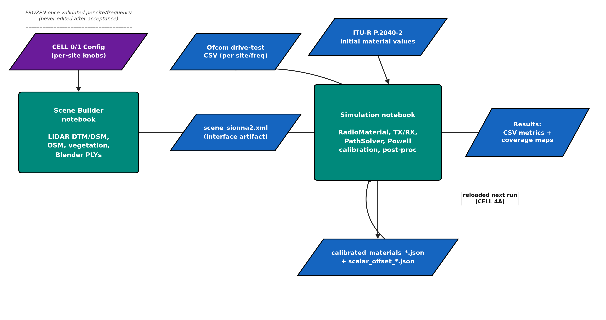
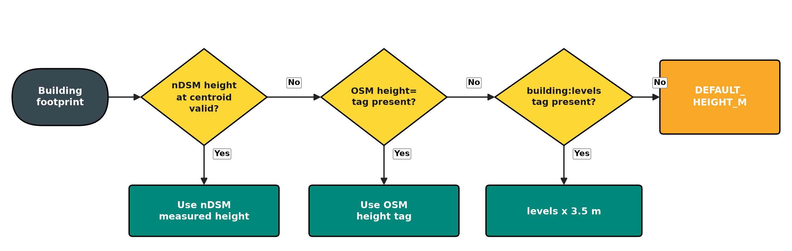

# Chapter 4 — Implementation / Experimental Setup / Simulation

Chapter 3 established *what* was done and *why* — the scientific approach, the tools selected, and the seven-step procedure that turns raw geospatial and measurement data into a calibrated, evaluated propagation model (Section 3.4). This chapter documents *how* that procedure was concretely realised in software: the code architecture that implements it (Section 4.1), the exact hardware, software, and per-site configuration values used (Section 4.2), how the three raw data sources were obtained and processed into scene geometry (Section 4.3), and the real technical failures encountered along the way, with root cause, fix, and version-control evidence for each (Section 4.4). Reproducibility is the organising concern throughout: every configuration value, file artefact, and fix reported here is either a directly observed notebook setting or a committed code change, not an inferred or idealised description of the pipeline.

## 4.1 Model Development / System Implementation

The methodology of Chapter 3 is implemented as a pair of Jupyter notebooks per site/frequency combination, following a consistent, config-driven architecture (Figure 4.1): a **scene-builder notebook** that turns raw geospatial data into a Sionna 2.0 scene file, and a **simulation notebook** that loads that scene, assigns and calibrates materials, places the transmitter and receivers, runs the ray tracer, and evaluates the result. Each notebook follows the same internal convention: a single configuration cell (`CELL 0`/`CELL 1`) holds every site-specific parameter, and every other cell is a self-contained processing step identified by a stable label (`CELL 2b`, `CELL 4A`, `CELL 8e`, etc.) that this thesis refers to directly — these cell labels are the actual notebook structure, not an abstraction introduced for the write-up.

**Figure 4.1 — Code/notebook architecture and data-artefact interfaces.**

*Figure 4.1 — The scene-builder and simulation notebooks are separate programs connected only through file artefacts (the scene XML, and the calibrated-material/scalar-offset JSON files), not through shared in-memory state or function imports. This lets the expensive scene-construction step (LiDAR download, mesh generation) run once and freeze (Section 3.3), while the simulation notebook is iterated on repeatedly during calibration without ever risking a scene rebuild.*

Four implementation components follow directly from Chapter 3's procedure:

**Material assignment and calibration (Steps 2 and 4).** Each surface material is instantiated via Sionna's `RadioMaterial` constructor — e.g. `RadioMaterial(name, relative_permittivity=<ε_r>, conductivity=<σ>, scattering_coefficient=<S>)` — one per entry in Table 3.2, initialised from ITU-R P.2040-2 [17]. Calibration (Equation 3.1) is implemented behind a `CAL_OPTIMIZER` configuration flag selecting between interchangeable back-ends that share the same three-phase structure (Section 3.4, Step 4), the same objective function, and the same output files (`calibrated_materials_<freq>.json`, `scalar_offset_<freq>.json`). Early development and several per-site runs used `scipy.optimize`'s Powell method [28], a derivative-free conjugate-direction search. For sites where the free-parameter space grew large and correlated — up to 18 simultaneous parameters at 1802 MHz, where permittivity, conductivity, and scattering interact through the Fresnel/scattering physics of Section 2.1.4 (Equation 2.16) — the joint-search phase was switched to the **Covariance Matrix Adaptation Evolution Strategy (CMA-ES)** [31], a population-based global optimiser implemented via the `cma` package that adapts its search covariance to the local objective landscape, a regime Powell's coordinate-wise search handles poorly. A differential-evolution back-end was also implemented and evaluated but converged more slowly (≈5.5 h vs. ≈2–3 h for CMA-ES at matched sample counts) and was not used for the final results. Table 4.4 records which optimiser was adopted at each site.

**Building geometry (Figure 4.2).** In the verified scene-builder notebook `sionna019_scene_builder.ipynb`, every building footprint receives a height through a four-level fallback chain, implemented as ordered conditional logic rather than a single lookup: the LiDAR nDSM height at the building centroid when available and physically plausible; otherwise the OSM `height=` tag; otherwise `building:levels × 3.5 m`; otherwise a fixed `DEFAULT_HEIGHT_M`. nDSM is preferred because OSM height/level tags are too sparse to rely on alone — doing so was found to cause far-field under-attenuation from buildings modelled too short. In the Nottingham scene, 92% of buildings resolve directly to an nDSM height.

**Figure 4.2 — Building-height derivation fallback chain.**

*Figure 4.2 — Implemented exactly as documented in `sionna019_scene_builder.ipynb`'s own configuration notes: nDSM is tried first, with three progressively coarser fallbacks so that every building footprint receives a height even where LiDAR/OSM data is incomplete.*

**Table 4.1 — LiDAR/DEM provider abstraction.**

| `NDSM_PROVIDER` | Coverage | Data source | Resolution |
|---|---|---|---|
| `'ea'` | England (≤55.9°N) | Environment Agency WCS (free, open) | 1 m |
| `'usgs'` | USA | USGS 3DEP WCS (free, open) | 1 m |
| `'opentopo'` | Global fallback | OpenTopography REST API (SRTM) | 30 m |

*Table 4.1 — The provider feeding the height fallback chain above is auto-selected by scene latitude/longitude rather than hard-coded. English sites (Nottingham, London, Stevenage) use `'ea'`; Scar Hill falls through to `'opentopo'`, since it lies north of the EA LiDAR boundary — the source of the terrain-resolution constraint discussed in Section 4.3.*

**Vegetation geometry.** Three implementation decisions jointly realise the frequency-dependent vegetation strategy introduced in Section 3.3 (Figure 3.2's decision point). First, disc density and layering are set by a configuration branch: `VEG_DISC_LAYERS = 1` with fixed layer-height fractions for the 915/1802 MHz scenes, versus `VEG_DISC_LAYERS = 3` at fractions `[0.30, 0.65, 1.0]` of crown depth for the shared 2695/3602 MHz scene, spaced four times more densely (10 m vs. 20 m grid spacing) with up to 1,000 discs per polygon rather than 500. Second, individual trees are placed independently from the LiDAR nDSM via local-maximum detection (5 m minimum inter-tree spacing, 3–30 m height band, building-footprint exclusion mask) — 15,486 trees in the Nottingham scene, each a canopy cone (`canopy_itu_vegetation`) plus trunk cylinder (`trunk_itu_wood`) alongside the disc layer. Third, and most consequentially, all vegetation geometry defaults to **flat, ground-level patches** rather than extruded 3D canopy volumes: at 915 MHz, a solid extruded canopy was found to be opaque to Sionna's surface-based ray tracer (Section 2.1.7), blocking 100% of rays passing through it and producing −10 to −15 dB of over-attenuation in wooded corridors. Flat patches instead let the `itu_vegetation` scattering material contribute diffuse loss at the ray level, while bulk excess attenuation is added separately in post-processing — Weissberger [18] below ~2 GHz, ITU-R P.833-10 [16] above (Section 4.4 discusses why this correction is applied per-path rather than per-receiver at the higher frequencies).

**[FIGURE 4.3 — PLACEHOLDER — requires a real scene screenshot, not fabricated]**
*3D scene preview (scene-builder notebook, `CELL PREVIEW`) for the Nottingham 915 MHz scene, showing the assembled terrain, building, vegetation-disc, and individual-tree geometry as actually loaded into Sionna RT.*

## 4.2 Experimental / Simulation Setup

**Compute platform.** Simulations are GPU-accelerated. `sionna019_calibration.ipynb` documents the compute configuration directly — an NVIDIA Tesla V100-SXM2-16GB GPU using Mitsuba's `cuda_ad_rgb` variant with `FORCE_CPU_RT=False` — independently confirmed via a live `nvidia-smi` query on the training VM (hostname `sti-virtual-machine`):

| Parameter | Value |
|---|---|
| GPU | NVIDIA Tesla V100-SXM2-16GB |
| GPU memory | 16,384 MiB (16 GB) |
| Driver / CUDA version | 580.126.20 / 13.0 |
| CPU | Intel(R) Xeon(R) Platinum 8176 @ 2.10 GHz, 12 vCPUs |
| System RAM | 62 GiB total (~43 GiB available at time of query) |
| Virtualisation | VMware hypervisor, full virtualisation |

At the time of the query, GPU utilisation was at 100% across four concurrent Python processes, consistent with multiple calibration runs (2695 MHz, 3602 MHz, London 915 MHz) executing in parallel on this machine — itself a practical constraint on how many runs could be validated concurrently (Section 5.4).

**Software environment.** The pinned dependency set, documented in `requirements_sionna019.txt`, is: `sionna==0.19.2`, `tensorflow==2.15.0`, `mitsuba==3.5.2`, `drjit==0.4.6`, `numpy==1.26.4`, `scipy==1.15.3`, the `cma` package for CMA-ES [31], `osmnx==2.0.7`/`geopandas==1.1.3`/`shapely==2.1.2`/`pyproj==3.7.1`/`rasterio==1.4.4` for the geospatial stack, and `matplotlib`/`pyvista`/`open3d`/`plotly` for visualisation. Installation follows the standard workflow (`conda create -n sionna019 python=3.10`, then `pip install -r requirements_sionna019.txt`). A separate, Sionna 2.0-targeted notebook set (`sionna2_*`) uses a newer Sionna/Mitsuba/Dr.Jit combination in an independent environment to avoid version conflicts, matching the scene-format distinction between the legacy Sionna 0.19 XML and the Sionna 2.0 XML written by `CELL B3` (Section 4.3).

**Table 4.2 — Ray-tracing and calibration configuration by site and frequency.** All frequencies share EPSG:27700 (British National Grid, `always_xy=True`), `MAX_DEPTH=8`, diffraction and edge diffraction enabled, and `TERRAIN_PAD_M=3000`. RX AGL = 1.5 m throughout.

| Parameter | Nottm 915 MHz | Nottm 1802 MHz | Nottm 2695 MHz | Nottm 3602 MHz | London 915 MHz | Scar Hill 915 MHz | Stevenage 915 MHz |
|---|---|---|---|---|---|---|---|
| TX AGL | 17 m | 17 m | 17 m | 17 m | 45 m | 17 m | — * |
| TX EIRP | — | — | 56 dBm | 54 dBm | 49 dBm | 46.9 dBm | — * |
| Noise floor | −124 dBm | — | −120 dBm | −109 dBm | — | −124 dBm | — * |
| `CAL_SAMPLES_PS` | 2 M | 2 M | 10 M | 30 M | 15 M | 10 M | 30 M |
| `NUM_SAMPLES_PS` | 100 M | 100 M | 100 M | 100 M | 100 M | 10 M | 100 M |
| `CAL_MAX_DIST_KM` | 1.5 | 1.5 | 1.0 | 1.0 | 1.75 | 1.5 | 1.5 |
| `CAL_SCALAR_BOUNDS` | (−20, 5) | (−20, 5) | (−30, 20) | (−60, 60) | (−60, 60) | (−30, 20) | (−30, 20) |
| `DISABLE_VEG_DISCS` | False | True | False | False | False | False | True |
| `DISABLE_CANOPY` | False | False | False | True | False | False | False |
| Terrain source | EA LiDAR 1 m | EA LiDAR 1 m | EA LiDAR 1 m | EA LiDAR 1 m | EA LiDAR 1 m | SRTM 30 m | EA LiDAR 1 m |
| Vegetation formula | Weissberger | Weissberger | ITU-R P.833-10 | ITU-R P.833-10 | Weissberger | Weissberger | Weissberger |
| Dual-slope R_bp (Eq. 2.13) | 311 m | 613 m | 916 m | 1225 m | 458 m | 311 m | — * |
| **Best R² (ON incoh.)** | **0.835** @ 0–750 m | **0.509** @ 0–1250 m | **0.574** @ 0–1250 m | **0.515** @ 0–1250 m | **0.365** @ 0–1000 m | **0.083** @ 0–1250 m | **0.744** @ 0–2250 m |

*Table 4.2 — `CAL_MIN_DIST_KM = 0.15` at every site. Scar Hill uses 10 M evaluation samples (matching calibration) rather than 100 M, since the coarser SRTM terrain does not benefit from the additional Monte Carlo precision (Section 4.3). Stevenage's own TX AGL/EIRP/noise-floor values (marked *) await confirmation from the site's `CELL 1`, so its R_bp is left unstated rather than estimated; its calibration outcome is discussed alongside the other sites in Table 4.4.*

**Table 4.3 — CMA-ES calibration hyperparameters** (shared across all sites using the CMA-ES back-end).

| CMA-ES parameter | Value | Meaning |
|---|---|---|
| Search space | Normalised [0,1] per dimension | ε_r, log σ, S for each free material, min–max scaled |
| σ₀ (initial step size) | 0.25–0.3 | Fraction of the normalised parameter range |
| Population size (λ) | 4 + 3·ln n (auto), or 36 (explicit) | n = number of free parameters; larger λ reduces ranking noise from the Monte Carlo objective |
| Max generations | 200–300 | Site-dependent stopping criterion |
| `tolfun` | 0.10 | Terminate when the population's function-value spread falls below 0.10 dB |
| Samples per evaluation | 10–30 M | Matched to `CAL_SAMPLES_PS`, keeping calibration and evaluation noise floors consistent |
| Fixed seed | 42 | Reproducibility; shared with the Powell back-end |
| Warm start | Enabled | Initialised from ITU-R P.2040-2 defaults with an S warm prior of 0.35 |

*Table 4.3 — The objective function, EM parameter bounds, and output files are shared with the Powell back-end (Section 4.1), so switching optimisers required no change to the surrounding pipeline (Figure 4.1).*

**Table 4.4 — Final calibration results by site and frequency.**

| Site / Frequency | Optimiser | Cal. RX | Free materials | Cal. RMSE | Best R² | Range |
|---|---|---|---|---|---|---|
| Nottingham 915 MHz | Powell | 208 | 6 | ~8–9 dB | **0.835** | 0–750 m |
| Nottingham 1802 MHz | Powell | — | 6 | — | **0.509** | 0–1250 m |
| Nottingham 2695 MHz | Powell | 373 | 6 | ~13.7 dB | **0.574** | 0–1250 m |
| Nottingham 3602 MHz | Powell | 601 | 6 | ~15.4 dB | **0.515** | 0–1250 m |
| London 915 MHz | CMA-ES | 223 | 5 | 6.888 dB | **0.365** | 0–1000 m |
| London 1802 MHz | CMA-ES | — | 5 | 13.829 dB | **0.365** | 0–1000 m |
| Scar Hill 915 MHz | Powell | 202 | — | 10.71 dB | **0.083** | 0–1250 m |
| Stevenage 915 MHz | None (Phase 0 only) | 1,200 | 0 | — | **0.744** | 0–2250 m |

*Table 4.4 — All R² values report ON incoherent (scattering ON, incoherent summation), which consistently outperforms coherent and OFF-scatter modes across all sites (Section 5.1). Nottingham 1802 MHz used `DISABLE_VEG_DISCS=True` over a 15,486-tree scene; 3602 MHz used `DISABLE_CANOPY=True` with per-path P.833-10 correction and a `z > 30 m` height filter (Section 4.4). London 1802 MHz's result (Run 4 of 8) was accepted as a physics floor after seven failed runs (Section 5.4, Table 5.3). Scar Hill's R² reflects an SRTM 30 m terrain-resolution floor rather than a calibration shortfall (Section 4.3). Stevenage is the only site where CMA-ES's joint material search converged to *no* improvement over the Phase 0 scalar offset (+1.05 dB) alone — evidence, not a shortfall, that this site's propagation is specular-dominated and already well described by ITU-R default materials (corroborated independently in Table 5.2).*

For the Nottingham scenes specifically, the scene bounding box is fixed identically across builder and simulation notebooks (`SCENE_WEST/EAST/SOUTH/NORTH`), because even a 0.025° mismatch was found to produce an ~855 m coordinate offset between terrain and building geometry — this bounding-box consistency is checked automatically before every run (Section 4.4) rather than trusted to manual discipline.

**[FIGURE 4.4 — PLACEHOLDER — requires real notebook output, not fabricated]**
*2D scene map (`CELL 6c`): all receivers plotted on an OpenStreetMap basemap, coloured by measured RSSI, transmitter marked with a star, with 500 m / 1 km / 2 km / 3 km distance rings.*

**[FIGURE 4.5 — PLACEHOLDER — requires real notebook output, not fabricated]**
*DTM → DSM → nDSM raster progression, three panels side by side: (a) bare-earth DTM, (b) surface DSM with above-ground clutter, (c) derived nDSM = DSM − DTM giving above-ground heights.*

## 4.3 Data Collection and Processing

Three raw data sources feed the implementation, each requiring its own acquisition and cleaning step before use in the methodology of Chapter 3.

**Ofcom measurement data.** Each site/frequency combination's ground truth is a single CSV exported from the Ofcom 2018 campaign [5], with one row per drive-test sample (WGS84 latitude/longitude, measured RSSI, and header metadata for transmitter height, EIRP, and noise floor).

**Table 4.5 — Ofcom 2018 dataset statistics by site and frequency.**

| Site | Frequency | Total records | Within scene bbox | Calibration RX (range) |
|---|---|---|---|---|
| Nottingham | 915 MHz | — | ~985 (0–2.5 km) | 208 (≤1.5 km) |
| Nottingham | 1802 MHz | — | ~1,177 (0–2.5 km) | — |
| Nottingham | 2695 MHz | 261,967 | 36,351 | 373 (≤1.0 km) |
| Nottingham | 3602 MHz | — | — | 601 (≤1.0 km) |
| London | 915 MHz | — | ~179 (0–2.0 km) | 223 (≤1.75 km) |
| London | 1802 MHz | — | — | 86 (≤0.75 km) |
| Stevenage | 915 MHz | — | 1,200 (0–2.25 km) | 1,200 (Phase 0 only) |
| Scar Hill | 915 MHz | 143,541 | — | 202 (≤1.5 km) |

*Table 4.5 — Calibration RX are receivers passing all three filters below. Nottingham 2695 MHz illustrates the typical density reduction from raw to usable: 261,967 total → 36,351 within the scene → 373 within the 1.0 km calibration range — a reduction of nearly three orders of magnitude that bounds the statistical power of the higher-frequency results (Section 5.4). Stevenage lists all 1,200 receivers as its calibration set because Phase 0's scalar-only fit uses the full dataset rather than a distance-restricted subset.*

Processing this file involves reprojecting from WGS84 to the scene's local EPSG:27700-derived coordinate frame, filtering to receivers falling inside the scene bounding box (an early implementation instead took the first *N* CSV rows before this filter, silently selecting receivers outside the scene for routes starting far from the transmitter — commit `9bb6be0`, Table 4.6), and the geometric validity checks (DEM sanity, 2D/3D building-interior tests) detailed procedurally in Section 3.4, Step 3. Before calibration, three further criteria are applied: a **noise-floor margin** discards records within 10 dB of the receiver noise floor, to avoid SNR-limited measurements biasing the objective; **distance bounds** exclude records below `CAL_MIN_DIST_KM` (0.15 km, where near-field geometry dominates) and above `CAL_MAX_DIST_KM` (Table 4.2), keeping calibration within a single propagation regime relative to the dual-slope breakpoint (Section 4.4); and **valid-path coverage** excludes any 100 m distance bin where fewer than 65% of receivers have valid simulated paths, from the calibration-range search.

**LiDAR terrain and vegetation data.** UK Environment Agency 1 m DTM and DSM tiles are queried from the EA's public WCS endpoint for the scene bounding box, padded by 3,000 m. Each site's terrain pipeline produces the same four artefacts in order: **`dem.tif`** (bare-earth DTM, merged per-tile, `CELL 2b`), **`dsm.tif`** (surface model including clutter, `CELL 2d`), **`ndsm.tif`** (nDSM = DSM − DTM, giving above-ground height at every pixel, `CELL 2d`), and **`terrain.ply`** (the DTM resampled onto a 1,000×1,000 mesh and triangulated into the ground-plane geometry Sionna RT traces against, `CELL 3`). Scar Hill, north of the EA LiDAR coverage boundary (55.9°N), obtains the same DTM/nDSM pair from 30 m SRTM data via OpenTopography instead — an identical downstream code path executing on categorically coarser input. This terrain-resolution gap, not a calibration or modelling deficiency, is why Scar Hill's best result (R² = 0.083, Table 4.4) sits an order of magnitude below every other site: it is treated in this thesis as a stated boundary condition on the reported results (Section 5.4), not an unexplained shortfall.

**OpenStreetMap vector data.** Building footprints, roads, waterways, and land-use polygons are queried via `osmnx`/`geopandas` for the scene bounding box, held as in-memory `GeoDataFrame` objects, reprojected to scene-local coordinates, and converted directly into per-material PLY meshes without an intermediate file format — `bld_itu_brick.ply`, `veg_itu_vegetation.ply`, `road_itu_asphalt.ply`, `water_itu_water.ply`, etc. (`CELL 4`). Road-junction polygons are dissolved via union to remove self-intersecting overlaps that would otherwise produce rendering artefacts. All three raw sources are reprojected into the same EPSG:27700 local coordinate frame before combination; a reprojection error at this stage would silently misalign every subsequent geometry and measurement comparison.

## 4.4 Challenges and Adjustments

Implementing the methodology of Chapter 3 surfaced a number of concrete technical problems, distinct from the modelling limitations already discussed in Section 3.3. Reporting them here — with root cause, fix, and version-control commit — is itself part of demonstrating a reproducible implementation: several would have silently corrupted results if left unfixed, rather than causing an obvious failure.

**Table 4.6 — Implementation bugs encountered, root causes, and fixes.**

| Problem | Root cause | Fix | Commit |
|---|---|---|---|
| Calibration RMSE completely flat across all Powell evaluations | Dr.Jit kernel caching reused a compiled kernel across evaluations with different material parameters | 3-probe sensitivity check before every calibration run; abort if Δ < 0.05 dB per probe | `6e2b4e2` |
| GPU memory exhausted (swap filled) after ~680 calibration evaluations | `PathSolver` result objects not explicitly deleted between evaluations | Explicit deletion of the solver result each iteration | `285eb13` |
| ±4 dB drift between nominally identical evaluations | No fixed random seed; Monte Carlo path sampling varied run to run | `CAL_FIXED_SEED = 42` applied throughout calibration and evaluation | — |
| Buildings appearing below ground level in the scene | `local_z` height lookup numerically unreliable at scene boundaries | Replaced with `RegularGridInterpolator` sampling the terrain PLY directly | `2bec77c` |
| A large vegetation polygon (M1 motorway corridor) received only 10 discs | `VEG_MAX_DISCS_PER_POLYGON` hard-capped at 10 | Raised to 500 (standard scene) / 1,000 (HF scene) | `c1d08d3` |
| O(n_receivers × 67,292) nested loop made Weissberger correction impractically slow | Naive per-receiver, per-polygon distance search | Replaced with an `STRtree` spatial index for vegetation geometry | `7c8bd5c` |
| Receivers silently placed outside the scene for routes starting far from the transmitter | CSV rows truncated to the first *N* before bounding-box filtering | Filter to bounding box first, then take the first *N* in sequential order | `9bb6be0` |
| 2695/3602 MHz `RadioMaterial` property access raised `TypeError` | Sionna's tensor-wrapped properties read with a bare `float()` cast | Introduced a `_safe_f()` unwrapping helper | `5ad27dd` |
| A `NearestNDInterpolator` silently shadowed by an unrelated variable | Variable-name collision (`_near`) between a fitted interpolator and a DataFrame slice | Renamed the DataFrame variable to `_df_near` | `ff8168d` |
| At 3602 MHz, calibration RMSE stuck with the scalar pinned at its bound | `CAL_SCALAR_BOUNDS = (-30, 20)` clipped the true optimum (~+30 dB) | Widened bounds to `(-60, 60)` | `8979235` |
| 17 scene-XML `INCLUDE_*` flags had no `_SKIP_PLY` guard — stale PLYs silently entered the XML | Missing guard condition in the scene-export cell (`CELL B3`) | Added a `_SKIP_PLY` guard to all inclusion flags | `e410b9a` |
| Building-height clips ignored `None`-aware configuration | `None` values triggered `TypeError` in height comparisons | Replaced with a `None`-aware `_bld_cap` / `_veg_cap` pattern | `2bdcec4` |
| Phase 3 re-scalar comparison was inverted — kept the worse result | Boolean condition `if new_rmse > old_rmse: keep` rather than `<` | Fixed the comparison direction | — |
| `itu_ceiling_board` not explicitly activated when `DISABLE_VEG_DISCS=False` | The material-loading cell (`CELL 4A`) only branched to transparentise the material; no `else` to activate it | Added an explicit `else` branch (ε_r=17, σ=0.15 S/m, S=0.50) before any `PathSolver` call | `470ab4a`, `2959d6b` |
| Stevenage EA VOM raster stored canopy height in decimetres, not metres | EA VOM tile convention specific to this area (median ≈178 dm, misread as 178 m) | Auto-detect: divide by 10 when the VOM tile median exceeds 20 | `ff637c2`, `ac0f341` |

*Table 4.6 — Commit hashes refer to the project repository at `joujou78/Ray-Tracing---Sionna-RT`, branch `claude/cool-cori-rrWbY`. A representative subset; several additional minor fixes are documented alongside the code itself.*

Four of these merit extended discussion.

**Vegetation geometry at high frequencies.** At 3602 MHz (λ = 8.3 cm), tree-branch diameters approach the wavelength, making solid canopy cones nearly opaque to the ray tracer: an active-canopy calibration attempt (`DISABLE_CANOPY=False`) produced a Phase 0 scalar of +30 dB and an uncalibratable RMSE above 29 dB, with all rays beyond ~400 m absorbed before reaching the receiver. The adopted fix disables 3D canopy/trunk geometry (`DISABLE_CANOPY=True`), making trees electromagnetically transparent, and instead applies a per-path ITU-R P.833-10 correction proportional to the canopy depth each ray segment traverses — computed from intersection tests against `paths.vertices` — with a `z > 30 m` height filter excluding segments travelling entirely above canopy level (commit `b15eb12`).

**Dual-slope breakpoint and calibration range.** Calibrating across the LOS/NLOS breakpoint R_bp (Equation 2.13; values by site in Table 4.2) mixes two distinct propagation regimes: at 2695 MHz, the per-range bias changes sign at R_bp ≈ 916 m, forcing the calibration scalar toward zero and collapsing R² from 0.246 (single-regime calibration to 1.0 km) to 0.173 (extended to 1.5 km, crossing the breakpoint). Consequently, `CAL_MAX_DIST_KM` is restricted below R_bp at every frequency — a non-obvious implementation constraint with material impact on the reported R² (Table 4.2).

**Scatter budget consistency.** A necessary condition for a valid result is that material state at calibration time matches material state at evaluation time. The `CELL 4A` bug in Table 4.6 broke this silently: with no `else` branch, the vegetation-disc material loaded at its internal default (ε_r ≈ 1, S = 0.10) during calibration rather than its intended active state, inflating the Phase 0 scalar diagnostic to +9.7 dB instead of the expected ≈−2.3 dB and driving all subsequent material optimisation to compensate for near-transparent discs that were, in fact, active at evaluation time. The Phase 0 scalar diagnostic — expected to land near a known reference value for a given site — was the signal used to detect this discrepancy before it corrupted a full calibration run.

**CMA-ES scattering-coefficient bounds.** London 1802 MHz's CMA-ES runs stalled at local minima whenever per-material scattering caps were set too tightly: with S_max(brick) = 0.35, RMSE plateaued at 15.6 dB across 200 evaluations with no improvement; raising to 0.40 reduced this to 14.9 dB but left brick's scattering coefficient pinned exactly at its cap after 348 evaluations — the diagnostic signature of an optimiser trapped against a bound rather than converged to a genuine minimum. Because the scatter flooding observed in an earlier run had already been traced to `concrete_barrier` and `metal_barrier` rather than brick or concrete, raising brick/concrete `S_max` to 0.45 was safe and let calibration descend past the prior plateau — the full eight-run history for this site is presented as sensitivity-analysis evidence in Table 5.3.

**[FIGURE 4.6 — PLACEHOLDER — requires real notebook output, not fabricated]**
*Calibration convergence plot: calibration RMSE (dB) versus CMA-ES generation number, showing convergence toward the Monte Carlo noise floor.*

**[FIGURE 4.7 — PLACEHOLDER — requires real notebook output, not fabricated]**
*Runtime scattering-coefficient sensitivity sweep (`CELL 8c`): RMSE/R² as a function of a runtime-overridden scattering coefficient, independent of the full joint-parameter search.*

Note: the coverage-map comparison and coarse-vs-detailed geometry figures flagged as placeholders in Chapter 3 (Figures 3.3 and 3.7), and the vegetation disc-layer schematic (Figure 3.4), are not repeated here — they illustrate the methodology-level *concept*, whereas this chapter documents its implementation-level *realisation*.

---

Taken together, this chapter's implementation record answers a question Chapter 3 could only pose in the abstract: whether the proposed calibration methodology survives contact with real, messy geospatial and measurement data. It does, but not without cost — fourteen distinct implementation bugs (Table 4.6), an optimiser switch driven by genuine parameter-space difficulty rather than preference (Section 4.1), and two sites (Scar Hill, Stevenage) whose results are shaped as much by input data quality and propagation physics as by calibration effort. This distinction between *implementation-level* causes of variation (documented here) and *result-level* interpretation of that variation is what Chapter 5 builds on.

*Figures 4.3–4.7 are marked as placeholders because they require running the actual notebooks and capturing real output — this environment has no GPU, no Sionna RT installation, and no access to the underlying scene/CSV files needed to produce them, so none have been fabricated. Figures 4.1 and 4.2 are original diagrams built from verified source material (the notebook architecture and the documented building-height fallback chain).*

*References for this chapter reuse [5], [16], [17], [18], [28] from Chapters 1–3 and [31] from Section 4.1. See `references.md` for the full, verified reference list shared across all chapters.*
