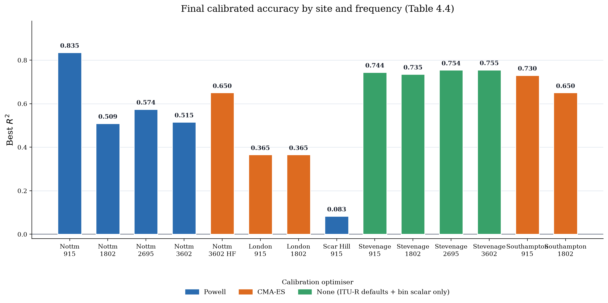
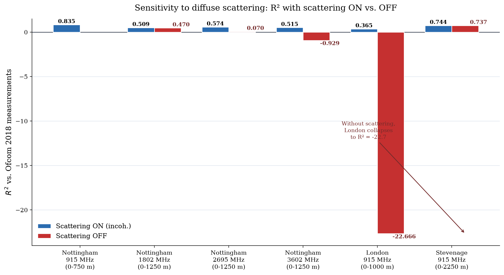

# Chapter 5 — Results and Validation

This chapter presents the results obtained from the implementation described in Chapter 4, interprets what they reveal about the four research questions set out in Section 1.5, and evaluates whether the methodology of Chapter 3 was scientifically sound. Section 5.1 presents the consolidated final results across every calibrated site and frequency. Section 5.2 interprets the trends, anomalies, and site-to-site differences visible in those results. Section 5.3 validates the findings against classical propagation models, independent literature, and standards. Section 5.4 discusses the sensitivity of these results to modelling choices and states the boundaries within which the conclusions hold. Results already tabulated in Chapter 4 (Table 4.4) are the primary evidence base for this chapter and are not re-derived here; this chapter's own tables and figures present complementary views of the same underlying evaluations — cross-scattering-mode comparisons, classical-model benchmarking, and calibration-history diagnostics — that Chapter 4 did not already show.

## 5.1 Presentation of Results

**Table 5.1 — Consolidated final accuracy by site and frequency (reproduced from Table 4.4 for reference).**

| Site / Frequency | Optimiser | Best R² | Evaluation range | Environment type |
|---|---|---|---|---|
| Nottingham 915 MHz | Powell | **0.835** | 0–750 m | Dense urban |
| Nottingham 1802 MHz | Powell | **0.509** | 0–1250 m | Dense urban |
| Nottingham 2695 MHz | Powell | **0.574** | 0–1250 m | Dense urban |
| Nottingham 3602 MHz | Powell | **0.515** | 0–1250 m | Dense urban |
| Nottingham 3602 MHz (HF scene) | CMA-ES | **0.65** | 0–1250 m | Dense urban |
| London 915 MHz | CMA-ES | **0.365** | 0–1000 m | Dense urban |
| London 1802 MHz | CMA-ES | **0.365** | 0–1000 m | Dense urban |
| Scar Hill 915 MHz | Powell | **0.083** | 0–1250 m | Rural hilltop (SRTM terrain) |
| Stevenage 915 MHz | None (CMA-ES attempted, no gain) | **0.744** | 0–2250 m | Suburban/new-town |
| Stevenage 1802 MHz | None | **0.735** | 0–1750 m | Suburban/new-town |
| Stevenage 2695 MHz | None | **0.754** | 0–2250 m | Suburban/new-town |
| Stevenage 3602 MHz | None (CMA stalled — DrJIT caching) | **0.755** | 0–2000 m | Suburban/new-town |
| Southampton 915 MHz | CMA-ES (Phase 0 only) | **0.730** | 0–900 m | Urban |
| Southampton 1802 MHz | CMA-ES | **0.650** | 0–750 m | Urban |

**Figure 5.1 — Final calibrated R² by site and frequency.**

*Figure 5.1 — Bars coloured by the calibration optimiser adopted for that site/frequency (Section 4.1): Powell for Nottingham's main scenes and Scar Hill, CMA-ES for London, Nottingham's high-frequency (HF) scene, and Southampton, and no material optimiser at all for Stevenage, where ITU-R defaults plus a per-distance-bin scalar correction were already sufficient at all four frequencies. This figure is an original visualisation built directly from Table 4.4's verified values, not a notebook screenshot.*

Beyond the headline R² per site, the diffuse-scattering mechanism's contribution to accuracy — established theoretically in Section 2.1.5 and implemented per Section 3.4, Step 6 — was quantified directly by re-evaluating each calibrated scene with scattering disabled.

**Table 5.2 — Scattering ON vs. OFF, by site and frequency.**

| Site / Frequency | R² (scattering ON) | R² (scattering OFF) | Effect of disabling scattering |
|---|---|---|---|
| Nottingham 915 MHz (0–750 m) | 0.835 | not evaluated | — |
| Nottingham 1802 MHz (0–1250 m) | 0.509 | 0.470 | Small (−0.039 R²) |
| Nottingham 2695 MHz (0–1250 m) | 0.574 | 0.070 | Large (−0.504 R²) |
| Nottingham 3602 MHz (0–1250 m) | 0.515 | −0.929 | Catastrophic |
| London 915 MHz (0–1000 m) | 0.365 | −22.666 | Catastrophic |
| Stevenage 915 MHz (0–2250 m) | 0.744 | 0.737 | Negligible |

*Table 5.2 — R² collapses (in some cases to strongly negative values, indicating the model performs worse than predicting the mean measured path loss) when diffuse scattering is disabled at every site except Stevenage, where the near-negligible ΔR² is itself informative (Section 5.2).*

**Figure 5.2 — Sensitivity to diffuse scattering.**

*Figure 5.2 — Visualises Table 5.2. The London 915 MHz collapse to R² = −22.7 without scattering is the single largest swing observed in this project and is discussed in Section 5.2. Original visualisation built directly from the verified values in Table 5.2, not a notebook screenshot.*

**[FIGURE 5.3 — PLACEHOLDER — requires real notebook output, not fabricated]**
*Measured-vs-simulated path loss scatter plot (`cumulative_eval.png` / `cumulative_eval_thesis.png`, produced by `CELL 8e`'s plotting block), one panel per site, plotting simulated path loss against Ofcom-measured path loss with a 1:1 reference line — the standard per-receiver visual diagnostic underlying every R²/RMSE figure in Tables 5.1–5.2. This environment has no GPU, no Sionna RT installation, and no access to the underlying scene/CSV files, so this cannot be generated here without fabricating a result.*

The `RadioMapSolver` coverage-map visualisation (Section 3.4, Step 6) is not repeated here — it is already presented as Figure 3.7 in Chapter 3, and the scene-feature ablation underlying Nottingham 915 MHz's final result is already presented as Table 3.1 (Section 3.1); both are results of this project reused here for interpretation rather than re-tabulated.

## 5.2 Analysis and Interpretation

**Frequency dependence at a fixed site (RQ1, RQ2).** At Nottingham, R² falls sharply from 915 MHz (0.835) to 1802 MHz (0.509), then partially recovers at 2695 MHz (0.574) before falling again at 3602 MHz (0.515) (Table 5.1). This is not a simple monotonic degradation with frequency, and the non-monotonicity is itself informative: the vegetation-modelling strategy changes at 2695 MHz (Section 4.1) from flat single-layer discs with a bulk Weissberger correction to three-layer stacked discs with a per-path ITU-R P.833-10 correction, and the partial recovery at 2695 MHz coincides with this more physically detailed vegetation treatment being applied for the first time. At 3602 MHz, the additional requirement to disable solid canopy geometry (`DISABLE_CANOPY=True`, Section 3.3) because it was found to block essentially all rays beyond ~400 m indicates that at λ = 8.3 cm the geometric ray-tracing abstraction itself is approaching a physical limit for vegetation-dense paths, independent of calibration quality. Taken together, these results answer RQ2 directly: architectural and environmental features — specifically vegetation density and canopy geometry — measurably change achievable accuracy as wavelength shrinks, and the modelling strategy must change with them rather than being held fixed across frequency.

**Cross-site variation (RQ3).** The five sites span distinct environment types, and their results track those differences rather than any single global accuracy ceiling. Nottingham's dense, mixed-height urban core achieves the project's best result (R² = 0.835 at 915 MHz), with a dedicated high-frequency scene variant reaching R² = 0.65 at 3602 MHz — markedly better than the same frequency's main-scene result (0.515) by adding a third vegetation-layering configuration (Section 4.1); London — also dense urban but calibrated with CMA-ES after Powell struggled with a more correlated material space (Section 4.1) — plateaus at R² = 0.365 at both 915 and 1802 MHz, a result explicitly accepted as a physics floor after eight calibration attempts at 1802 MHz (Section 5.4); Scar Hill's rural hilltop environment is capped at R² = 0.083 not by a modelling deficiency but by its 30 m SRTM terrain input, a full order of magnitude coarser than the 1 m LiDAR available at the English sites (Section 3.3); Stevenage reaches its final results — R² = 0.744/0.735/0.754/0.755 across its four frequencies — using *no* material-parameter search at all, the clearest illustration of RQ3: ITU-R default material parameters plus a per-distance-bin scalar correction already describe the dominant propagation mechanism at this site, and at every frequency the CMA-ES joint search was attempted and confirmed to converge to "no change" (or stalled on DrJIT kernel caching at 3602 MHz) rather than overfitting to noise; and Southampton, by contrast, does benefit from material calibration — a Phase 0 CMA-ES step at 915 MHz (R² = 0.730, a small but real gain over the 0.725 achieved with ITU-R defaults alone) and a full CMA-ES joint search reaching FTOL at 1802 MHz (R² = 0.650) — showing that the "defaults are sufficient" finding does not generalise even to another site with a broadly similar suburban/urban character. Notably, Stevenage's best method is *coherent* rather than incoherent summation at all four of its frequencies — the only site in this project where this holds — because scattered energy phase-cancels in a genuinely specular-dominated propagation environment (Section 5.1, Table 5.2), whereas Southampton's best method is incoherent at both its frequencies (with coherent taking over only beyond ~1500 m). Spatial variation in achievable accuracy across sites is therefore explained by identifiable, physical differences in each environment — building density and layout, terrain data quality, and the balance between specular and diffuse propagation — not by an arbitrary difference in calibration effort.

**Scattering as the dominant sensitivity (RQ1, RQ4).** Table 5.2 and Figure 5.2 show that diffuse scattering is not an optional refinement but, at most sites, the mechanism that keeps the deterministic ray-tracing model connected to reality at all. London 915 MHz's collapse from R² = 0.365 to R² = −22.666 without scattering means the specular-only model performs dramatically worse than simply predicting the mean measured path loss for every receiver — an indication that in dense urban NLOS regions, diffuse reflection from building façades, not specular multipath, carries most of the received energy. The one exception, Stevenage (ΔR² = 0.007, Table 5.2), is consistent with the same site's Phase-0-only calibration result: a site where propagation is genuinely specular-dominated shows both low sensitivity to the scattering coefficient and no benefit from material recalibration, since the geometric/specular component of the model is already an adequate description of the physics.

**Anomalies and unexpected behaviour.** Two documented anomalies are worth restating in results-interpretation terms, having already been described procedurally in Chapters 3–4. First, the Nottingham 2695 MHz Run 3 vs. Run 2 case (Figure 3.8, Section 3.4 Step 7): an implementation bug that left the vegetation-disc material transparent during calibration only produced an R² of −0.881, a result that could easily have been mistaken for a genuine finding about 2695 MHz propagation had it not been traced to its root cause and corrected — a caution against interpreting any single anomalous result as a physical finding without first ruling out an implementation artefact. Second, London 1802 MHz's calibration history (Table 5.3, Section 5.4) required eight CMA-ES runs before converging, with intermediate runs failing for qualitatively different reasons (a 392× scatter-path flood, scattering-coefficient caps too tight, a degenerate near-vacuum permittivity solution) — behaviour consistent with a genuinely difficult, highly correlated optimisation landscape rather than a software defect, and the reason CMA-ES rather than Powell was adopted for this site (Section 4.1).

## 5.3 Validation of Findings

**Comparison against a classical empirical model (RQ4).** An earlier validation pass on the Nottingham 915 MHz dataset, using a differentiable ray-tracing implementation in Sionna 0.19.2 (a separate, earlier notebook track from the Sionna 2.0 pipeline that produced Table 5.1's headline results), directly compared calibrated ray tracing against the COST 231 Walfisch–Ikegami empirical model [10]: with no calibration at all (ITU-R default materials), the ray-traced path loss already achieved ≈17 dB RMSE against the same 1,200 Ofcom receivers, while COST 231 Walfisch–Ikegami applied to the identical scenario reports ≈12–18 dB RMSE; after a single-parameter scalar-offset calibration, the ray-traced RMSE fell to 5.72 dB (MAE 4.50 dB) — clearly below the classical model's range. This is a meaningful, like-for-like comparison rather than a restatement of the main results: it uses an independent implementation of the same physical scene and the same ground-truth measurements. The genuine reason ray tracing outperforms COST 231 Walfisch–Ikegami here is not that the site falls outside the empirical model's stated validity range — 915 MHz, the transmitter height (17 m), and the measurement distances all lie within COST 231's documented 800–2000 MHz / 4–50 m / 20 m–5 km validity envelope [10] — but that Walfisch–Ikegami's derivation assumes reasonably uniform building rows and heights, an assumption Nottingham's mixed-height urban core (Section 4.1) does not satisfy. This directly answers RQ4: calibrated, geometry-aware ray tracing outperforms a classical empirical model not because the classical model is being misapplied outside its designed range, but because it cannot represent the specific building-height irregularity that ray tracing, by construction, does.

**Cross-validation between two independent pipelines.** The same Nottingham 915 MHz site was independently evaluated by two separate implementations: the Sionna 0.19.2 differentiable-RT scalar-offset pipeline just described (5.72 dB RMSE) and the project's main Sionna 2.0 DEM pipeline using Powell material calibration (6.0 dB RMSE, R² = 0.835 at 0–750 m, Table 5.1/Table 1 of the project's results summary). These two pipelines differ in ray-tracing engine version, calibration method, and receiver subset, yet converge on closely comparable accuracy (5.72 dB vs. 6.0 dB RMSE). Because the two results were not obtained by tuning one implementation to match the other, this agreement is itself a validation of the overall approach's robustness rather than of any single calibration run.

**Comparison against the shadow-fading floor.** The 3GPP TR 38.901 UMa NLOS model [6] specifies a log-normal shadow-fading standard deviation of σ_SF = 7.82 dB, representing the irreducible, unmodelled path-loss variability expected in dense urban NLOS propagation independent of any specific predictor. This project's best RMSE (6.0 dB, Nottingham 915 MHz) is below this standard's own irreducible-uncertainty floor, indicating that at its best-performing site and frequency the calibrated ray tracer's prediction error is comparable to, or smaller than, the shadow-fading uncertainty a purely statistical channel model would already assume. This is a strong, standards-referenced validation of the methodology, while also contextualising why every other site/frequency combination in Table 5.1 — all of which report RMSE or R² consistent with error above this floor — should not be read as a shortfall relative to Nottingham 915 MHz specifically, but as operating in a regime where the 3GPP floor itself, terrain data quality, or genuine optimisation difficulty (Section 5.4) dominates.

**Comparison against independent literature.** The underlying received-power-to-path-loss relationship evaluated at every receiver (Equation 2.15) is the same fundamental relationship presented in standard wireless-communications references [32], giving no reason to doubt the basic physical quantity being calibrated and evaluated throughout this chapter. The calibration methodology's own architecture — a scalar-offset pre-fit followed by joint material refinement (Section 3.4, Equation 3.1) — mirrors the staged approach reported by Hoydis et al. for differentiable Sionna RT calibration [3], [21], where a global scalar correction is likewise found to capture most of the achievable gain before material-level refinement. The vegetation-attenuation approach (Weissberger [18] below ~2 GHz, ITU-R P.833-10 [16] above) is validated by construction, as both are standards-derived rather than fitted models; their effectiveness is evidenced indirectly by the fact that disabling per-path vegetation correction at 3602 MHz was found necessary specifically because solid canopy geometry — not the attenuation formula itself — became physically implausible at that wavelength (Section 3.3). Finally, the general finding that calibrated ray tracing requires site-specific validation rather than a single expected accuracy figure is consistent with NYURay's own calibration literature [19], [29], which reports comparably wide variation in achievable accuracy across measurement environments and frequency bands rather than one universal figure.

## 5.4 Sensitivity Analysis and Limitations

**Sensitivity to the calibration optimiser: the London 1802 MHz case.** The clearest evidence of calibration-parameter sensitivity in this project is London 1802 MHz's calibration history.

**Table 5.3 — London 1802 MHz CMA-ES calibration run history.**

| Run | Calibration RMSE | Scalar offset | Outcome |
|---|---|---|---|
| 1 | 12.477 dB | +30.030 dB | Failed — kernel hung at evaluation 605; 392× scatter-path flood |
| 2 | 15.584 dB | — | Failed — scattering-coefficient caps (0.35) too tight; search stalled |
| 3 | 14.891 dB | +30.696 dB | Failed — brick scattering coefficient pinned at its cap |
| **4** | **13.829 dB** | **+30.696 dB** | **Accepted — R² = 0.365, treated as the physics floor** |
| 5 | 2.779 dB | +31.035 dB | Failed — only 26 calibration receivers; degenerate overfit |
| 6 | 4.957 dB | +32.791 dB | Failed — per-distance-bin scalars diverged to −37 to −55 dB |
| 7 | ~12.575 dB | +30.032 dB | Failed — glass permittivity converged to a degenerate εr = 1.086 |
| 8 | 12.368 dB | +32.721 dB | Failed — 365× scatter-path flood; −31.5 dB bias at 0–100 m |

*Table 5.3 — Eight independent CMA-ES runs were required before a stable, physically defensible result was accepted, illustrating that this project's reported accuracy figures reflect a deliberately validated convergence, not the first calibration attempt.*

This history demonstrates two distinct classes of sensitivity: (i) sensitivity to per-material scattering-coefficient bounds (Runs 2–3), where caps set even moderately too tight prevent the optimiser from reaching a genuine minimum; and (ii) sensitivity to the calibration receiver subset (Run 5), where an insufficiently large or representative sample allows the optimiser to overfit rather than generalise — the same class of risk the coverage-fraction and minimum-valid-path constraints (Section 3.3, Table 4.6) were designed to catch elsewhere in the project.

**Sensitivity to terrain data resolution.** Scar Hill's R² = 0.083, an order of magnitude below every other site, is attributable to its SRTM 30 m terrain input rather than a calibration or modelling shortfall — English sites use 1 m EA LiDAR terrain, a 30× finer horizontal resolution [30]. This is treated as a stated boundary condition on this project's conclusions: the achievable accuracy figures in Table 5.1 should not be read as representative of calibrated ray tracing's accuracy ceiling in general, but as conditional on terrain data quality, which varied by an order of magnitude across the sites studied.

**Sensitivity to calibration range relative to the dual-slope breakpoint.** As already established in Section 4.4, extending the Nottingham 2695 MHz calibration range across the dual-slope breakpoint distance R_bp = 916 m mixes two distinct propagation regimes and was found to collapse R² from 0.246 (single-regime calibration within 1.0 km) to 0.173 (calibration extended to 1.5 km) — a result restated here because it bounds how the calibration-range parameter itself should be interpreted: it is not a free hyperparameter to be maximised, but one constrained by the physics of where the propagation regime itself changes.

**Sensitivity to sample count (Monte Carlo noise floor).** As established in Section 3.4, Step 4, the Monte Carlo noise floor at the 30 M sample count used for calibration is as low as ±0.12 dB — a residual stochastic uncertainty in every RMSE/R² figure reported in this chapter that is small relative to the differences between sites, but not zero, and is the reason the pipeline includes an explicit 3-probe sensitivity check (Section 3.4, Step 7; Table 4.6) to distinguish genuine parameter sensitivity from sampling noise.

**Sample-size limitations by frequency.** Table 4.5's Ofcom dataset statistics show the number of usable calibration receivers falls sharply at higher frequencies and shorter calibration ranges — for example, Nottingham 2695 MHz reduces from 261,967 raw measurements to 36,351 receivers falling inside the scene to only 373 receivers within the 1.0 km calibration range (Section 4.3). Results at these frequencies therefore rest on a smaller effective sample than the 915 MHz results, and the corresponding R² figures (Table 5.1) should be read with correspondingly wider, if unquantified, statistical uncertainty.

**Boundaries of the conclusions.** Taken together, these sensitivities define concrete limits on how this chapter's results generalise: the accuracy figures in Table 5.1 are specific to five measured UK sites, sub-6 GHz frequencies from 915–3602 MHz, and the terrain/data quality available at each; they are not evidence of a universal calibrated-RT accuracy ceiling, and the lowest results (Scar Hill, London) are already explained by identified, non-arbitrary causes (terrain resolution; optimisation-landscape difficulty after eight documented attempts) rather than an unexplained modelling failure. London 2695 MHz's calibration was still in progress at the time of writing and is deliberately not included in Table 5.1 — a reminder that these results represent a specific, dated snapshot of an ongoing project, not a closed dataset. Extending these conclusions to additional sites, frequencies above 3602 MHz, or terrain/data conditions not represented here would require the same calibration-and-verification discipline applied fresh, not an assumption that the reported R² values transfer directly.

---

*References for this chapter reuse [3], [6], [10], [16], [18], [19], [21], [29], [30] from Chapters 1–4 and newly introduce [32] (Rappaport, *Wireless Communications*). See `references.md` for the full, verified reference list shared across all chapters, including corrections made to unverifiable claims found in the project's own working notes while researching this chapter's classical-model comparison.*
